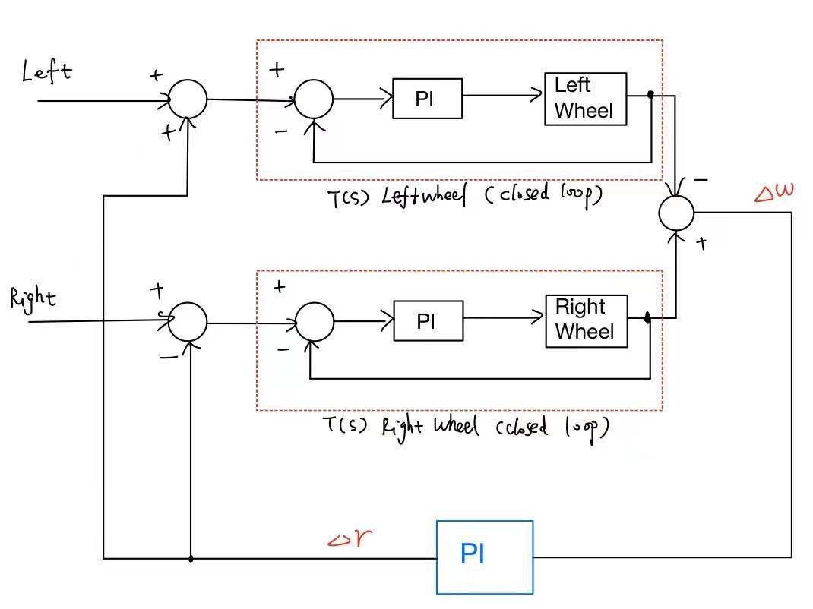
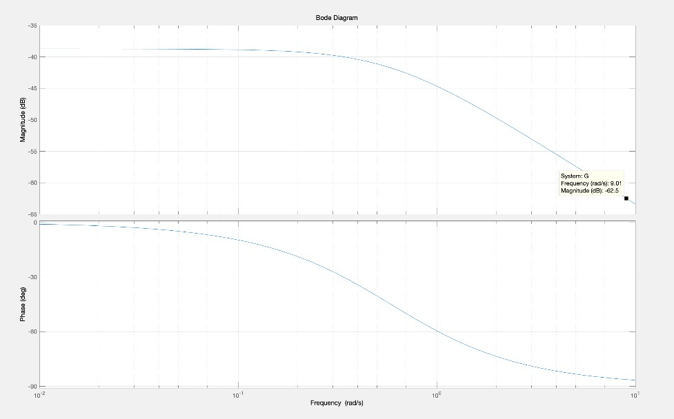
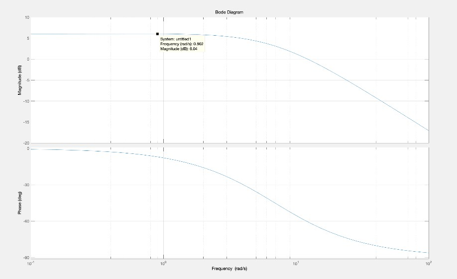
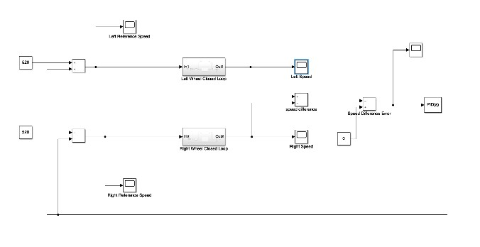
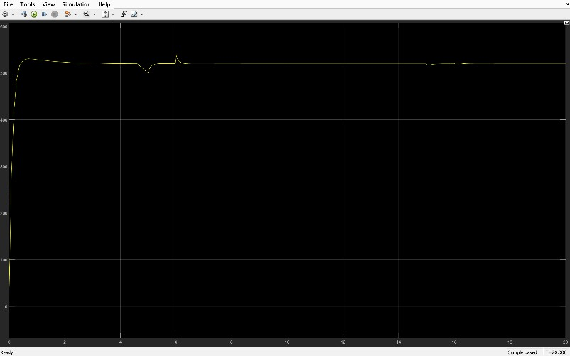
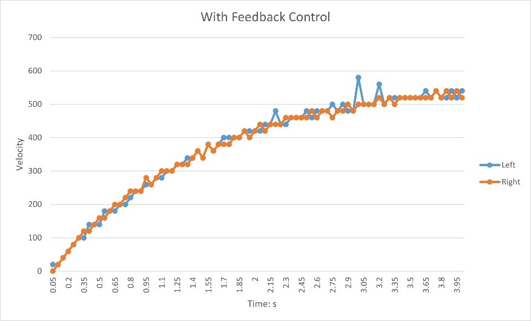

I write a program for this robot car in order that it can move along a straight line. In ideal situation, there is no difference between two wheels, which means that robot car will move along a straight line automatically. But in the reality, the real rotating speeds of two wheels are different due to kinds of factors. So, this robot car cannot move straightly if I simply set two fixed values to two wheels. Thus, a system with feedback control is needed to make sure that the final speeds of two wheels are the same.

1. Design Block Diagram

   The engine motivates two wheels of this robot car so that we need to design a system for the two wheels. Not only do we need two feedback control systems for two wheels respectively, but we also need another system to keep 0 difference between the speed of two wheels.

   The following diagram basically shows the whole project structure.

   

2. Get Fundamental Data

   Since we need a system to help robot car move straightly, we need the original data of the car's movement. 

   The robot car provides a feature that could record how many roations of a wheel in every 0.0025 second. To better represent, I summed every 20 values together as the speed. With the data, I could start up designing my system.

   ```
   fit=stable value*(1-e^(-at) ),where a=1/(when achieve 0.632×stable value)
   ```

   This "fit" means the value we would like to have finally.

   Then we can have a forward transfer function.

   ```
   G(s)=520/44999*(0.588/(s+0.588))
   ```

3. Design PID Controller

   To reduce the steady-state-error, we need to design a PI compensator for this transfer function. Here, frequency response method was used. I plotted the bode diagram of G(s)

   

   After we choose an appropriate 0-dB frequency, we could have:

   ```
   G_C(s)=1333.5 (s+0.901)/s
   ```

   Then, I convert it into z-domain by Tustin method to implement digital system design: 

   ```
   G_CZ(z)=Z{G_C(s)}=(1335z-1332)/(z-1)=D/E

   D[k]=D[k-1]+1335E[k]-1332E[k-1]
   ```

   Then I could get transfer function of outside system in that block diagram:

   ```
   G_2(s)=2*feedback(G(s)×G_C(s), 1)=(15.41(s+0.901))/((s+0.9209)(s+15.08))=T(s)
   ```

   We can also plot its frequency response:

   

   With the basically similar approach, we get its digital design:

   ```
   r[k]=r[k-1]+0.49911w[k]-0.49911w[k-1]
   ```

4. Simulation

   Up to now, we finished our design, But it is very important to simulate the system to check if it can work well and meet our requirements before we implement it.

   Using Simulink in Matlab:

   

   We could find if the simulation result is acceptable:

   

   From this image, we found that the speed reached steady state quite soon. So it is acceptable. Now, we can try to implement the system.

5. Implementation

   Since main.cpp is about how the robot car starts and how to record speed value, I would like to here show some cores of control.cpp which directly relates to this PID controller implementation.

   ```
   u_left = u_left_previous + 1335*eL - 1332*eL_previous;

   u_right = u_right_previous + 1335*eR - 1332*eR_previous;

   //u_left is the output of left closed loop wheel system(subsystem), and eL is the input for the system.

   //u_right is the output of right closed loop wheel system(subsystem), and eR is the input for the system.
   ```

   The inside feedback control system has been implemented, and we try to use the outputs of this system to be the inputs of outside feedback control syste.

   ```
   double w = -(u_left - u_right);

   //In my trial, the left speed is larger than right speed.

   //So, w is negative to feedback control the whole system.

   r = r_previous + 0.49911*w - 0.49911*w_previous

   //r is the output of the outside compensator, and it is negative.

   ```

   After implementing these digital controls above, we need to determine the relationships among these variables:

   ```
   eL = left + r - u_left;

   //r is negative, so it can cancel the larger left side.

   eR = right - r - u_right;

   //r is negative, so it can compensate the smaller right side.

   //Then, eL and eR are treated as the inputs of the inside systems
   ```

   Then, I just replace every \[k-1] item by current  \[k] item to prepare for the next round. At last, the value of u_left and u_right will be sent to left and right as the PWM values to control the robot car.
   
6. Design Verification

   In more than 3 times consecutive run, the robot car could move in a straight line. I plot the record of two wheels' speed here:

   

   So, I finally met the requirements and I would like to share the experimental run video here.
   
   https://www.youtube.com/watch?v=5lemnanl604
   
7. Conclusion

   Through this small project, I reinforced the dynamic control system knowledge learned from class. If we want to achieve a better result, we could replace the original engine by more powerful one so that it would reach the steady state faster.
