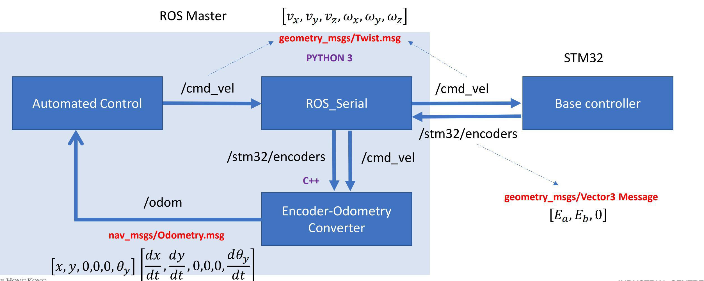
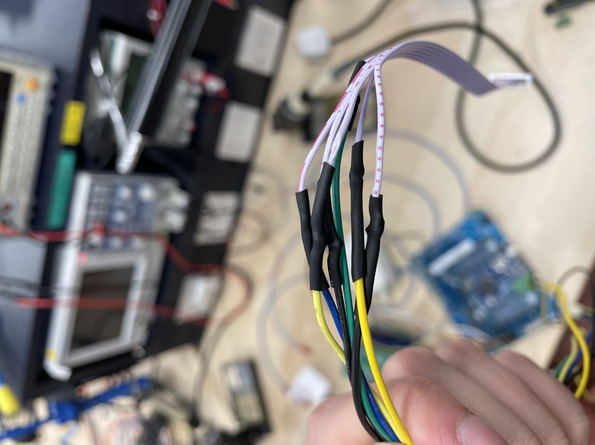
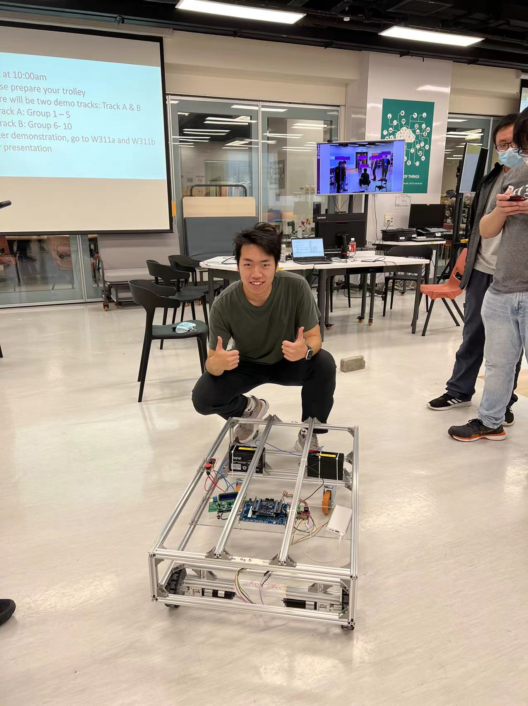

A group containing with groupmates coming from different majors focuses on this project that we would like to produce an intelligent carrier trolley with different controlling modes. I would like to share this interesting process by 3 satges.

**Stage 1**

At first we did not clearly know what we should do step by step to achieve our final goals. So, we decided to start thinking about what the hierarchy of the project would be like and try to provide as many configuration solution as we can. We thought up of 5 different solutions of configuration and listed their advantages and disadvantages. In addition, we considered some different modules we need to care about in this project, and determine their different priorities. Though they were quite raw thoughts with little realistic restricting conditions, this process led us to be gradually clear about what we should do.

Stage 1 nearly continued for 3 weeks with a path that is not so fast. We basically finished all parts of pre-design and we earned some great ideas from other projects. This stage built firm fundamentals for our project, especially in the part of deciding how to conduct our project step by step.

**Stage 2**

The second stage is the most time-consuming stage. We focused on software about how to control our trolley to move in certain direction at certain speed.

Two micro-controllers were used in our project. The one was STM32F103ZETb, and the other one was Raspberry Pi. They carried different work to perform their best so that we could get higher efficiency in this project. The below diagram (from Vincent Chan, PolyU) shows their relationship. The former one was a base controller to directly control two motors moving. And the latter carried Robot Operation System (ROS) to decide what speed and direction signals should be sent to base controller. Besides, it would perform artificial intelligence work in the work of next semester. These two controllers were connected together by USB cable to exchange information of cmd_vel and encoder. As for operators, we connected our laptop with Raspberry Pi with ssh so that we could use our keyboard as input and control our trolley.



Then we started our work on codes development. We first used STM32CubeMX to set up hardware related properties such as labels, TIM status and other hardware related properties, which not only made sure that our controller would run successfully but also helped us save time in the later codes modification. After setting up these properties, we could generate our code in Keil uvision to further develop it.

We first initialized our Timers so that we could use PWM to control the speed of motors. The motors would rotate in a higher speed if we set PWM with a higher duty cycle and this was the basic theorem that how we control our trolley.

```
/* Initialize all configured peripherals */
  MX_GPIO_Init();
  MX_DMA_Init();
  MX_USART1_UART_Init();
  MX_TIM1_Init();
  MX_TIM3_Init();
  MX_TIM4_Init();
  MX_TIM5_Init();
  MX_USB_DEVICE_Init();
  MX_IWDG_Init();
```

To control our motors, we used variable named as twin_motors_rotations. According to the status of the variable, 0 or 1, the motors would be driven in clockwise direction or counterclockwise direction. To control the trolley turning right or left, we separately control two variables, linear velocity and angular velocity. The trolley would change its moving direction if we change the value of angular velocity because there would be a difference between the velocity of two motors caused by positive or negative angular velocity. As for how to change the rotating direction, we change the status of two different pins of motors to choose clockwise or counterclockwise.

We also tried to develop a PID control system. PID includes three parts, which are
Proportional, Integral and Derivative. Proportional part is used to multiple error, a value between target value and sensor reading value. Integral part is the running sum of previous errors, used for correcting movements when error is small. And Derivative part is the change in errors, which is used for predicting what the next error would be.

**Stage 3**

We started our wiring work and trolley configuration in this stage. I spent much time connecting different wires in this stage. It included some work such as
cutting wire, welding, heating protecting tube. The final wiring result provided a reliable connection between motors and controllers and a power supply connection between battery, motors and controllers. The connecting wires made by myself is shown below.



**Conclusion**

Up to now, this trolley is developed basically. In the future we would like continuously develop it so that it can operated intelligently based on SLAM and other methods. This project really helped me gain much experience in ROS development and team-work.

